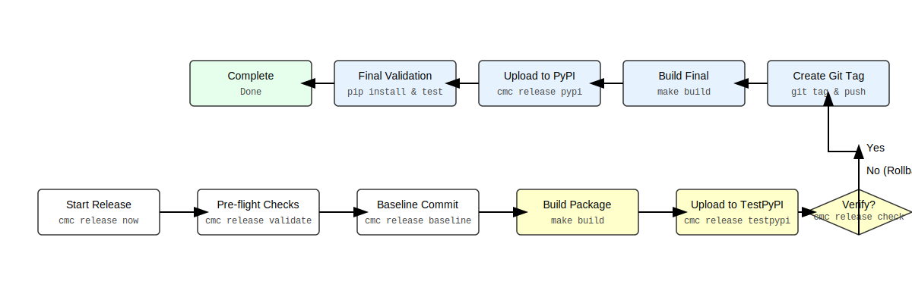

# Cloudmesh AI Release Automation

Cloudmesh AI Release is an automation extension for the `cmc` (Cloudmesh Commands) tool. It transforms the error-prone process of releasing Python packages to PyPI into a structured, wizard-driven workflow.

By enforcing pre-flight checks, managing state, and providing a "safety net" via baseline commits and rollback capabilities, it ensures that every release is consistent, documented, and reversible.

## Quickstart

The tool is designed to be flexible regarding your working directory. You can run it from a parent directory by specifying the package path, or from within the package directory itself.

### Option 1: The Wizard (Recommended)

Run the interactive wizard that guides you through all steps.

**From a parent directory:**

``` bash
# Specify the path to the package root
cmc release now cloudmesh-ai-cmc
```

**From within the package directory:**

``` bash
# Use '.' to indicate the current directory
cmc release now .
```

The tool will automatically detect the actual package name from the `pyproject.toml` file located at the specified path.

### Option 2: Bulk Releases

Manage and execute releases for multiple packages in a single session.

``` bash
# Add packages to the release plan
cmc release plan add cloudmesh-ai-common
cmc release plan add cloudmesh-ai-cmc

# List planned packages
cmc release plan list

# Execute the release wizard for all planned packages
cmc release plan do
```

### Option 3: Granular Control

Execute each phase manually:

``` bash
cmc release validate cloudmesh-ai-cmc
cmc release baseline cloudmesh-ai-cmc
cmc release testpypi cloudmesh-ai-cmc
cmc release pypi cloudmesh-ai-cmc
cmc release check cloudmesh-ai-cmc
```

------------------------------------------------------------------------

## Usage

``` text
Usage:
  cmc release now [options] <package_path>
  cmc release validate <package_path>
  cmc release baseline [options] <package_path>
  cmc release testpypi [options] <package_path>
  cmc release pypi [options] <package_path>
  cmc release check <package_path>
  cmc release rollback [options] <package_path>
  cmc release version [action] <package_path>
  cmc release clean-tags [options]
  cmc release plan add <package_name>
  cmc release plan list
  cmc release plan do [options]
  cmc release (-h | --help)

Options:
  -h --help                Show this screen.
  --dry-run               Simulate the process without making changes.
  --version <text>        Specify the target version for the release.
  --skip-testpypi         Skip the TestPyPI validation phase.
```

### Subcommand Details

#### `now`
The primary entry point for releasing a package. It initiates an interactive wizard that includes a **Version Review** table to confirm projected versions before proceeding.

- **`<package_path>`**: The path to the root directory of the package.
- **`--dry-run`**: Simulates the entire process.
- **`--version <text>`**: Force a specific target version.
- **`--skip-testpypi`**: Skip the TestPyPI validation phase.

#### `plan`
Manage bulk releases across multiple packages.
- **`add <package>`**: Adds a package to the release configuration.
- **`list`**: Displays all packages currently in the release plan.
- **`do`**: Executes the release wizard sequentially for all planned packages.

#### `version`
Manage the `VERSION` file directly.
- **`dev+ <package>`**: Increments the `.devN` suffix in the `VERSION` file.
- **`prod+ <package>`**: Increments the patch version in the `VERSION` file.
- **`<package>`**: Displays the current version and suggested next increments.

#### `clean-tags`
Interactively clean up Git tags.
- **`--all`**: Show all tags. By default, it only shows `.dev` tags.
- Use this to remove stale development tags from both local and remote repositories.

#### `rollback`
Emergency recovery tool to restore the local environment to the pre-release state.
- **`<packagename>`**: The directory name of the package to roll back.

------------------------------------------------------------------------

## Versioning Lifecycle

This tool uses a `VERSION` file in the package root as the source of truth, synchronized with Git tags.

### How it Works

The tool follows a strict versioning cycle to prevent collisions between TestPyPI and production releases:

1.  **The Source of Truth**: The `VERSION` file and the most recent Git tag define the current state.
2.  **Version Projection**: Before starting, the tool analyzes PyPI, TestPyPI, and Git tags to project the next logical versions.
3.  **The TestPyPI Cycle (`.dev` versions)**: 
    To avoid uploading a version to TestPyPI that might already exist on PyPI, the tool automatically calculates a development version. 
    - If the last stable version was `1.2.3`, the tool suggests `1.2.4.dev1` for TestPyPI.
4.  **The Production Cycle**: 
    Once the TestPyPI version is verified, the tool creates the official stable tag (e.g., `v1.2.4`) and uploads it to PyPI.
5.  **Automatic Baseline Bump**: 
    Immediately after a successful PyPI release, the tool automatically bumps the patch version and creates a new baseline tag for the next development cycle.

### Overriding the Version
You can force a specific target version using the `--version` flag:
`cmc release now <package> --version 1.2.4`

------------------------------------------------------------------------

## How it Works: The Release Lifecycle

The release process is designed as a safety-first pipeline.

### Workflow Diagram



``` mermaid
graph LR
    %% Style Definitions
    classDef white fill:#ffffff,stroke:#333,stroke-width:1px;
    classDef yellow fill:#ffffcc,stroke:#d4d4aa,stroke-width:1px;
    classDef blue fill:#e6f3ff,stroke:#adcceb,stroke-width:1px;
    classDef green fill:#e6ffed,stroke:#c2e0c6,stroke-width:1px;

    Develop[Develop<br/><small>develop your code</small>] --> A[Start Release<br/><small>cmc release now</small>]
    A --> B{Pre-flight Checks<br/><small>cmc release validate</small>}
    B -- Fail --> C[Stop/Fix]
    B -- Pass --> D[Create Baseline Commit<br/><small>cmc release baseline</small>]
    D --> E[Build Package<br/><small>make build</small>]
    E --> F[Upload to TestPyPI<br/><small>cmc release testpypi</small>]
    F --> G{User Verifies Install?<br/><small>cmc release check</small>}
    G -- No -.-> Develop
    G -- Yes --> I[Create Git Tag<br/><small>git tag & push</small>]
    I --> J[Build Final Artifacts<br/><small>make build</small>]
    J --> K[Upload to PyPI<br/><small>cmc release pypi</small>]
    K --> M[Final Validation<br/><small>pip install & test</small>]
    M --> L[Release Complete<br/><small>Done</small>]
    L -.-> Develop

    %% Assign Classes
    class Develop,A,B,C,D white;
    class E,F,G,H yellow;
    class I,J,K blue;
    class L green;
```

### Detailed Phases

#### Phase 1: Pre-flight Validation
Verifies dependencies (`git`, `twine`, `python`), the `build` module, and ensures the Git working directory is clean.

#### Phase 2: Establishing the Baseline
Captures the current `HEAD` commit and creates a "Baseline" commit to ensure a 100% recovery path.

#### Phase 3: TestPyPI Validation (The Sandbox)
1. **Version Calculation**: Determines the next `.dev` version.
2. **Build & Upload**: Builds artifacts and uploads them to TestPyPI.
3. **Verification**: The wizard pauses for manual installation verification.

#### Phase 4: Production Release
1. **Git Tagging**: Creates the official stable tag (e.g., `v1.2.4`).
2. **Build & Upload**: Re-builds artifacts and uploads to PyPI after double-confirmation.
3. **Post-Release**: Automatically bumps the version for the next cycle.

------------------------------------------------------------------------

## Safety Mechanisms

### State Tracking (`.release_state.json`)
Maintains a hidden state file to track progress and enable the `rollback` command.

### Rollback Logic
The `rollback` command:
1. Deletes the local and remote git tags.
2. Performs a `git reset --hard` to the baseline commit.
3. Cleans up the `dist/` directory and state file.

### Audit Logging
Every release creates a `release_<version>.log` file containing timestamps, executed commands, and full `STDOUT`/`STDERR`.

------------------------------------------------------------------------

## Configuration & Requirements

### Authentication
Relies on `twine`. Configure credentials via environment variables:
``` bash
export TWINE_USERNAME=__token__
export TWINE_PASSWORD=pypi-your-api-token-here
```

### System Requirements
- **Python 3.8+**
- **Git**: Configured with a remote `origin`.
- **Twine**: `pip install twine`
- **Build**: `pip install build`

------------------------------------------------------------------------

## Development & Contribution

### Local Installation
``` bash
cd cloudmesh-ai-release
make install
```

### Development Workflow
Use the provided `Makefile`:

| Target          | Action                                     |
|:----------------|:-------------------------------------------|
| `make test`     | Run the pytest suite                       |
| `make test-cov` | Run tests with coverage report             |
| `make build`    | Build sdist and wheel distributions        |
| `make check`    | Validate distribution metadata using twine |
| `make clean`    | Remove build artifacts and cache           |

## License
Apache License, Version 2.0